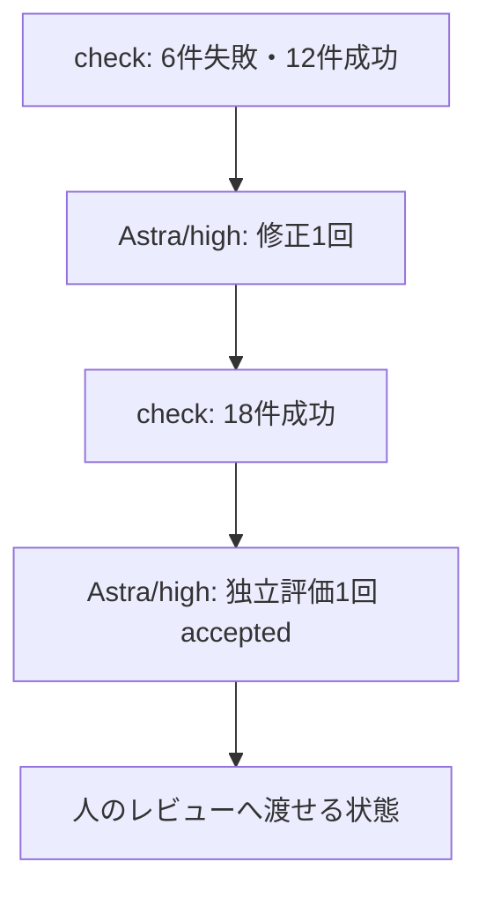

# 失敗から修正・再評価への接続試行

[Issue #13](https://github.com/thkt/dotagents-workflow-trial/issues/13)の初回結果。制御コードはcommit `8fd0c9d` のscripts/correction.jsとscripts/codex-actor.jsを使った。以後の追加は制御テストと文書・証拠のみで、実行コードは同一。

## 実測した経路

隔離した商品アプリで、比較対象の小文字化を外し、READMEを検索未実装時点へ戻した。[注入差分](injected.diff)はモデルの自然発生ミスではない。試行中の進行・結果の中継・ファイル修正を親タスクは行っていない。親タスクは事前準備、開始、読み取りによる進捗確認、事後確認と公開を担当した。

制御CLIがcheckの終了コード1と失敗ログを修正実行へ渡し、修正後のcheckを実行し、別の評価実行へ要求と対象を渡した。修正担当は検索処理とREADMEの両方を修復し、評価担当は製品の要求・テスト・文書を確認してacceptedとした。

同じ設定で終端結果を再照合したところ、追加モデル実行なしで同じ結果を返した。回数・累計時間も不変。[結果と対象hash](result.json)、[修正担当の応答](repair.json)、[評価担当の応答](review.json)を保存した。修正後はアプリコードが元のmainと一致し、[mainからの残る差分](repaired.diff)はREADMEの説明だけだった。これは隔離コピーの結果で、製品の追加変更としてこのPRへ取り込んでいない。

## 実行量

| 役割 | 回数 | 秒 | input tokens | cached input tokens | output tokens |
| --- | ---: | ---: | ---: | ---: | ---: |
| 修正 | 1 / 2 | 73.10 | 129115 | 88448 | 1965 |
| 独立評価 | 1 / 2 | 33.30 | 96694 | 64000 | 719 |

モデル実行は計106.40秒（約1分46秒）、合意した累計20分以内。Codexの起動・終了を含むホスト計測で、check・準備・公開・CI待ちを含まない。料金比較ではなく、cached inputはinputの内数。[usage](usage.json)には取得できた値を保存した。

対象アプリの基準は `5cff1d6f0ae8ad839e23c05965f8128a72998429`。check失敗時は6件失敗・12件成功（40.2秒）、修正後は18件成功（9.2秒）。実行途中に上限を変更したり、新しいディレクトリへ移して回数を初期化したりしていない。

## 制御テストとレビュー範囲

モデルなしの14件のテストは、同じCLI入口で失敗からの復帰、文書監査の差し戻し、要求・成果物の変更、不正な評価応答、実行失敗、人の判断要求、修正・評価の回数上限、モデル・checkの時間超過、消費量を保った再実行、中断予約、変更後の成功証拠の流用拒否を確認した。

既存の18件のE2Eは維持する。制御テストは模擬コマンドを使うため、LLMの判断品質の評価には数えない。今回の独立LLM評価は隔離コピーの商品アプリを対象としており、制御CLI自体を独立LLMが監査した結果ではない。制御CLIは親タスクが実装・コード確認・テストし、PRで人がレビューする。

## 結論の限界

- 実測できたのは「check失敗→修正→check成功→独立評価成功」の1経路。READMEも初回の修正で直ったため、実モデルの文書監査差し戻しは今回発生していない。
- 比較対照・反復はなく、効率改善や見逃し率、広い課題での成功率は結論づけない。
- 中断・状態不明では安全に停止する。完全自動再開、並行実行、公開の重複防止、自動マージは未実装・未評価。
- 対象hashはGitの追跡・非ignoreファイルと要求取得結果に対応し、依存環境や外部サービス全体の同一性は保証しない。
- 同一ユーザーによる制御コード・状態・検証定義の悪意ある改変に耐える隔離基盤ではない。

生のモデルJSONL、全checkログ、設定、要求取得スクリプトは実行端末の `/private/tmp/dotagents-correction-trial-13` に残る。一時領域なので長期保管を保証しない。共有用の結果・差分・再現方法はこのリポジトリに残した。
